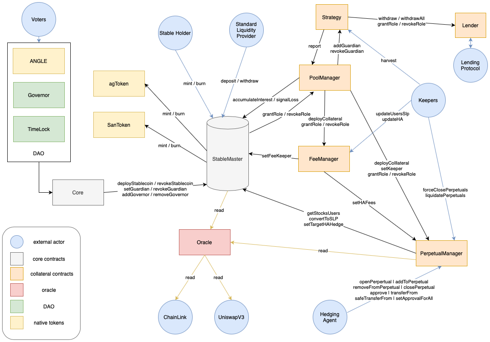

# Angle Protocol

This repo contains the Core Smart Contracts of the Angle Protocol. It is these contracts that are going to be deployed on mainnet and that have been audited by Chainsecurity and Sigma Prime.

## Documentation

Angle is a decentralized stablecoin protocol, designed to be both over-collateralized and capital-efficient. For more information about the protocol, you can refer to [Angle Official Documentation](https://docs.angle.money).

If you would like to know how the protocol works under the hood and how these smart contracts work together, you can also check [Angle Developers Doc](https://developers.angle.money).

The smart contracts of the protocol are structured as follows:

For a broader overview of the protocol, you can also check the [Angle Interfaces Repo](https://github.com/AngleProtocol/angle-interfaces).

## Audits

Angle smart contracts have been audited by Sigma Prime and [Chainsecurity](https://chainsecurity.com/security-audit/angle-protocol/). The audit reports can be found in the `audits/` folder of this repo. Every contract of the protocol has been audited at least by one of the two auditors.

The `main` branch of this repo contains the code of the contracts that have been deployed. The other branches are the audited branches.

## Bug Bounty

At Angle, we consider the security of our systems a top priority. But even putting top priority status and maximum effort, there is still possibility that vulnerabilities exist.

We have therefore setup a bug bounty program with the help of Immunefi. The Angle Protocol bug bounty program is focused around our smart contracts with a primary interest in the prevention of:

- Thefts and freezing of principal of any amount
- Thefts and freezing of unclaimed yield of any amount
- Theft of governance funds
- Governance activity disruption

For more details, please refer to the [official page of the bounty on Immunefi](https://immunefi.com/bounty/angleprotocol/).

| Level    |                     |
| :------- | :------------------ |
| Critical | up to USD \$500,000 |
| High     | USD \$20,000        |
| Medium   | USD \$2,500         |

All bug reports must include a Proof of Concept demonstrating how the vulnerability can be exploited to be eligible for a reward. This may be a smart contract itself or a transaction.

## Usage

Note that this repo is not the repo on which the Angle Core Team develops. The one containing all the tests on the smart contracts will be shared after short the official launch of the protocol. We still feel that it is important for everyone to be able to evaluate the content of the smart contracts of the protocol before interacting with it on mainnet.

## Further Information

For more info about the protocol:

- [Twitter](https://twitter.com/AngleProtocol)
- [Discord](https://discord.gg/9EKFec2MBm)
